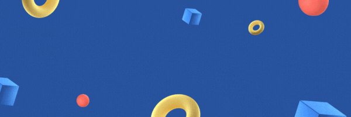

Hi there &lt;developers/&gt;!👋

I am Elie Muluke and I am a software developer. 

---

- 📫 Visit my **[website portfolio](https://eliemuluke.github.io/myPortfolio/)** for more details on my skills, projects and contact.

- 🌱 I’m currently learning **Flutter Mobile Development**.
- 🤓 I’m a passionate learner and always looking to learn new things.
- 👯 I’m looking to collaborate on **closed** and **open** source projects.
- 😄 Pronouns: **He** | **Him** | **His**
- 😀 I like to **game**, **watch anime**, **listen to music**, **play sports**, **gym**, **code**, and **read** in my free time.
- ⚡ Fun fact: My First line of code was not "**Hello World**".
- 💬 Ask me about gaming and game development.

---

## Github Stats

  
  

---

 I enjoy **networking** and **connecting** with new people and I'd be happy to **link up** sometimes! 😊
